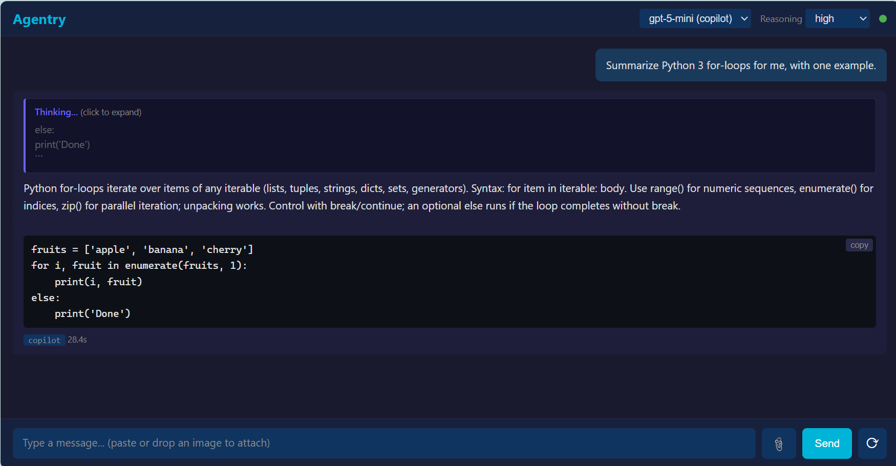

# Agentry

**Point your OpenAI SDK at the coding-agent subscription you already pay for.**
*The agent built to call tools becomes the tool.*

Agentry wraps a coding-agent CLI — GitHub Copilot, OpenAI Codex, or Claude Code —
and serves the model behind it as a plain OpenAI-compatible HTTP API on localhost.
Your scripts, apps, and pipelines talk to `gpt-5-mini` or `claude-sonnet` through the
subscription you're already logged into — no per-token API bill, no `-p` spawn tax.

[](https://dev.to/tommy_leonhardsen_81d1f4e/i-built-an-openai-compatible-proxy-for-github-copilot-because-search-was-too-stupid-to-understand-31de)

If you'd rather read the unhinged origin story than boring sysadmin-grade
docs, the [dev.to version is here](https://dev.to/tommy_leonhardsen_81d1f4e/i-built-an-openai-compatible-proxy-for-github-copilot-because-search-was-too-stupid-to-understand-31de) —
it covers why this proxy exists in the first place (short answer:
Norwegian guitar tabs and questionable life choices). The rest of this
README is the boring documentation, which sysadmins know to love.

It holds one coding-agent CLI subprocess persistent across requests, drives it
over JSON-RPC 2.0 (stdio), and exposes the result as an OpenAI-compatible HTTP
API on localhost. Per-turn latency drops from ~8 s in `-p` mode to roughly the
model's own `api_ms` floor (~2–3 s for short replies with `gpt-5-mini` at
`low` reasoning effort).

A minimal chat **web UI** ships with the proxy. It is not the point of the
project — just a quick way to confirm the API works end-to-end. The launcher
prints a clickable URL (`http://localhost:8765` by default) on startup.



Wraps three interchangeable backends, selected with `--backend`:

- **`copilot`** (default) — GitHub Copilot via the official
  [Copilot SDK](https://github.com/github/copilot-sdk). The free
  tier; `gpt-5-mini` at `low`/`high` reasoning.
- **`codex`** — OpenAI Codex (`codex app-server`). The paid-but-cheap tier
  (ChatGPT Go $8 / Plus $20); runs whatever model codex itself is configured
  for (see note under Configuration) at `low` effort.
- **`claude`** — Anthropic Claude Code (`claude -p`). The premium tier;
  default `claude-sonnet-4-6`.

The copilot and codex backends hold one persistent runtime process (copilot
through the SDK's managed server, codex over hand-rolled JSON-RPC 2.0 stdio),
so both get the no-spawn-cost win. claude-code has no such server mode, so the
`claude` backend is **cold-start** — one fresh `claude -p` per turn, ~2.5s
overhead (lean config), trading that for zero cross-turn context bleed. It's
built for long single-shot tasks (e.g. exam enrichment, 40–90s/turn) where the
startup is noise. See `archive/CLAUDE-PLAN.md`. Adding a backend is implementing
one `Backend` class in `backends.py`.

## The idea: reverse MCP

The Model Context Protocol (MCP) standardizes one direction: how a model
*consumes* external capabilities. A host app embeds an LLM and connects to MCP
servers that expose tools and data — the arrow points `LLM ──▶ tools`.

Agentry points the arrow the other way. A coding-agent CLI is, by design, an
MCP *client*: it exists to call tools. Agentry wraps that agent and serves the
model as a plain HTTP endpoint, so ordinary software consumes the model instead:

```
MCP       LLM  ───▶  tools / data      (the model consumes capabilities)
agentry   code ───▶  LLM  (HTTP)       (your code consumes the model)
```

The agent built to call tools becomes the tool. And agentry *enforces* the flip
rather than just narrating it: every backend runs with its tool surface switched
off — the copilot session is created with an empty tool allowlist plus a deny-all
permission handler; codex and claude get every tool/permission/filesystem request
refused at the wire (JSON-RPC `-32601`). Stripped of its ability to consume
tools, the agent is left as a pure language service behind an OpenAI-shaped API.

A lens, not a protocol: agentry speaks the OpenAI chat API, not MCP, and does
not interoperate with MCP tooling. The point is the direction of the arrow —
turning a tool-using agent into a tool other programs use — not a shared wire
format.

## Status

Working tool. Used by the author as the primary enricher across adjacent
projects (`shiny-fiesta`, soon `geomap`). Three backends:
`copilot` (free), `codex` (paid-cheap), and `claude` (premium, cold-start) —
see `TODONT.md` for which other CLIs were considered and declined.
Auth uses your existing CLI logins via the local credential store.

ToS posture differs per backend. The `copilot` backend rides the official
[GitHub Copilot SDK](https://github.com/github/copilot-sdk) (GA) — embedding
Copilot programmatically is now a *supported* product surface, not a hack.
(Serving it back out as an OpenAI-shaped chat endpoint is admittedly not the
use case GitHub had in mind, but it's built on the front door, not a wrapped
interactive CLI.) The `codex` and `claude` backends still wrap interactive
CLIs programmatically and sit in the usual gray ToS zone — for those, use a
non-critical account, don't expose externally, keep volume modest.

## Quick start

Common prerequisites:

- Python 3.11+ (the `github-copilot-sdk` dependency requires it)
- For the `copilot` backend: a GitHub account logged in to Copilot on this
  machine (`copilot login` once, from any installed Copilot CLI). The SDK
  downloads and caches its own pinned CLI runtime on first start — a native
  binary, so Node.js is NOT required to run agentry — but reads the same
  `~/.copilot` credential store the login wrote.
- For the `codex` backend: OpenAI Codex CLI on PATH and logged in
  (`codex login`, ChatGPT account — no `OPENAI_API_KEY` needed).
- For the `claude` backend: Claude Code CLI on PATH and already logged in
  (its own OAuth/API key); `-p` runs headless and never prompts.

### Windows (PowerShell 7+)

The launcher must be run from the same logon session as your interactive
`copilot login` so the cred-store token is reachable to child processes.

```powershell
cd C:\devel\aweussom\python\agentry
.\start.ps1                                          # copilot, gpt-5-mini, reasoning=low
.\start.ps1 -Backend codex                           # codex, model from codex config, effort=low
.\start.ps1 -Backend claude                          # claude, claude-sonnet-4-6 (cold-start)
.\start.ps1 -Port 9000
```


### Linux / WSL2 Ubuntu

One-time login inside your Linux environment (in WSL2, inside WSL — not via
the Windows host; the npm CLI is only needed for this login step):

```bash
npm install -g @github/copilot
copilot login

cd ~/path/to/agentry
chmod +x start.sh                                    # first checkout only
./start.sh                                           # copilot, gpt-5-mini, reasoning=low
./start.sh --backend codex                           # codex, model from codex config, effort=low
./start.sh --backend claude                          # claude, claude-sonnet-4-6 (cold-start)
./start.sh --port 9000
```

Open `http://localhost:8765` (or the port you chose) and chat. From a WSL2
shell, the same URL works from a Windows browser thanks to automatic port
forwarding.

## Configuration

Launcher params:

- `-Port` — HTTP port (default `8765`).
- `-Backend` — `copilot` (default), `codex`, or `claude`.
- `-Model` — model override.
    - `copilot`: set as the SDK session's model. Free tier: `gpt-5-mini`
      (default), `gpt-4.1`, `claude-haiku-4.5`. Paid tiers add more
      (Claude Sonnet 4.6, Opus 4.7, GPT-5.x family).
    - `codex`: passed on `turn/start`. No default — when unset, agentry
      omits the override and each thread runs on codex's own configured
      model (`~/.codex/config.toml`).

      > **Note:** codex persists the model you last selected in its
      > interactive TUI to that same config file. So without an explicit
      > `-Model`, switching models in the codex TUI **silently changes what
      > agentry uses** from its next thread on. This is deliberate — it
      > tracks OpenAI's model migrations (e.g. `gpt-5.4-mini` →
      > `gpt-5.6-luna`) without a code change — but if you need a stable
      > prod model, pin it with `-Model`. The startup log's
      > `codex thread: ... (default model=...)` line shows what each thread
      > actually resolved to.
    - `claude`: passed to `claude --model`. Default `claude-sonnet-4-6`.
- `-ReasoningEffort` — `low`, `medium`, `high` are confirmed end-to-end on
  copilot and codex. On `copilot` it is a session parameter (live changes go
  through the SDK's model-switch call); on `codex` it is a `turn/start` param.
  The SDK accepts `low`/`medium`/`high`/`xhigh`; other edge values (`none`,
  `max`, `minimal`) are not reachable on copilot.
  **No-op on `claude`** — claude-code (`-p`) exposes no reasoning-effort knob.

The web UI has a per-request reasoning-effort dropdown that overrides the
launcher default at runtime.

### Console

When idle, the launcher console pulses a `...*...*...*` heartbeat that rewrites
itself in place once a second (no scroll). While a `copilot` turn is in flight,
that same line becomes a **news ticker**: it scrolls the model's current output
line — the streamed reasoning summary while it thinks, then the response as it
writes — restarting whenever the model moves to a new line. Long high-effort
turns show visible work instead of a silent console. On the `codex` backend it also drops
a permanent quota line into scrollback when going idle and every ~10 min after —
e.g. `codex go quota | weekly 22% left (resets 06 Jun 10:51)` — and appends the
remaining quota to each turn's completion line. The figure is primed at startup
(`account/rateLimits/read`) and kept fresh by the rate-limit snapshots codex
pushes per turn, so there are no extra API calls during normal use. (Output
redirected to a file suppresses the heartbeat; the permanent quota lines still
appear.)

#### copilot quota

The `copilot` backend shows no quota line. An earlier opt-in feature metered
monthly **premium-request** billing via a GitHub PAT and the user billing API,
but it was removed: base models like `gpt-5-mini` never consume premium
requests (the readout was a permanent `0/N`), the footer's live rolling-window
rate limit isn't exposed by any public API, and org/enterprise-managed (SSO)
accounts return HTTP 400/403 from user-level billing altogether. The startup
ready-line does print the authenticated login (`user=...`, via the SDK's
`auth.getStatus`) so you can always see which account is serving requests.
If a real meter is ever wanted, the SDK's per-turn `assistant.usage` events
carry quota snapshots (entitlement/used/remaining %) for the logged-in account
— internal SDK fields today, but the right source when they stabilize.

#### claude quota

The `claude` backend shows your real Claude Code OAuth usage (5-hour session %
and weekly %) when [`claude-code-quota`](https://github.com/aweussom/claude-code-quota)
is installed — it keeps `~/.claude/quota-data.json` fresh off claude's own
status-line ticks (no daemon). agentry reads that cache passively (no network,
no extra dependency), rendering e.g.:

```
claude quota | 5h 54% left (resets in 31m) | weekly 74% left (resets in 1d15h)
```

If the tool isn't installed, it falls back to the coarse `rate_limit_event`
claude streams each turn (status + reset window, no %), e.g.
`claude five_hour: allowed (resets 31 May 12:10)`.

## Architecture

`agentry.py` is the Flask layer (routes, OpenAI shape, session reuse).
`backends.py` holds a `Backend` ABC and the three implementations. The
copilot backend delegates transport to the official `github-copilot-sdk`
(which runs the Copilot CLI runtime in server mode and speaks JSON-RPC to
it); codex owns a persistent subprocess driven by a small hand-rolled
JSON-RPC 2.0 client; claude cold-starts one `claude -p` process per turn.
The Flask layer talks only to the `Backend` interface (`new_session` /
`prompt` / `cancel` / `update_reasoning_effort` / `is_alive` / `close`), so
swapping backends is a `--backend` flag.

The turn lifecycles map almost one-to-one:

| Concept | `copilot` (SDK) | `codex` (app-server) |
|---|---|---|
| Handshake | `CopilotClient.start()` | `initialize` |
| New session | `create_session()` | `thread/start` |
| User turn | `session.send()` | `turn/start` |
| Reasoning override | session param / `set_model()` | `effort` on `turn/start` |
| Streamed deltas | `AssistantMessageDelta` events | `item/agentMessage/delta` |
| Turn complete | `SessionIdle` event | `turn/completed` notification |
| Cancel | `session.abort()` | `turn/interrupt` (`threadId`+`turnId`) |

In both, the agent's tool surface is switched off to keep the proxy a pure
chat client (no agent capabilities — by design): the copilot session is
created with an empty tool allowlist (`available_tools=[]`) plus a deny-all
permission handler; codex gets tool/permission/filesystem requests refused
with JSON-RPC `-32601` and additionally runs each thread with
`approvalPolicy: never` + `sandbox: read-only`. This is where the reverse-MCP
inversion is enforced: the tool-consuming half is off, leaving only the
language model to be served.

Turn lifecycle is hardened against the ugly paths: a codex `turn/start` that
errors (bad model, dead thread) is surfaced to the client immediately instead
of stalling until the stream timeout; a turn abandoned by timeout is cancelled
server-side (`session.abort()` / `turn/interrupt`) so it stops burning quota;
and stray updates from an abandoned turn are dropped (copilot: the event
queue is turn-scoped; codex: updates tagged with a stale turn id are
filtered), so a zombie turn can never bleed text into the next request's
response.

OpenAI-compatible endpoints exposed:

- `GET /health` — readiness probe.
- `GET /v1/models` — single model entry reflecting current `-Model`.
- `POST /v1/chat/completions` — SSE streaming, standard OpenAI delta format.
- `POST /v1/cancel` — cancels the in-flight turn (copilot: `session.abort()`;
  codex: `turn/interrupt` with the active turn's id; claude: kills the
  `claude -p` process).

The web UI at `/` is a single-page chat copied and pared down from the
NoLlama project. Markdown rendering, code-block copy, image attach
(button / paste / drag-drop — sent as `image_url` data: URIs), and live
think-blocks: the server forwards copilot's streamed reasoning summaries as
`delta.reasoning_content` (the DeepSeek-popularized SSE extension; standard
OpenAI clients ignore it) and the UI folds them into a collapsible
"Thinking..." block above the answer. Codex reasoning
(`item/reasoning/textDelta`) is not forwarded yet.

**Artifacts**: fenced ` ```html `, ` ```svg `, and ` ```markdown ` blocks in
a reply get an "open ▸" button that renders them in a side panel — HTML/SVG
in a sandboxed iframe (scripts run, but no same-origin access to the chat
page), markdown through a small built-in document renderer (headers, lists,
tables, quotes, links, code). Esc closes the panel.
`.github/copilot-instructions.md` asks the model to precede renderable
documents with YAML frontmatter (`title: ...`); the UI consumes it — the
title labels the open button and the panel header instead of rendering as
text. Frontmatter is optional: untitled fences still get a plain open
button, and stray `---` blocks without a `title:` render as ordinary text.

## Per-project instructions

`.github/copilot-instructions.md` is loaded by Copilot for each session
it opens in this directory. It tells the agent: treat prompts as standalone
chat questions, do not read repo files, do not request tools, do not inject
system reminders or context hints, be terse. This overrides any global
custom-instructions file in `~/.copilot/` that would otherwise leak hints
(SQL tables, todo lists, etc.) into prompts.

## File map

| Path | Purpose |
|---|---|
| `agentry.py` | Flask server + OpenAI surface + backend selection |
| `backends.py` | `Backend` ABC + `CopilotSDKBackend` + `CodexAppServerBackend` + `ClaudeCodeBackend` |
| `logutil.py` | Shared timestamped logging + idle keepalive |
| `templates/index.html` | Web UI shell |
| `static/css/style.css` | Web UI styles |
| `static/js/app.js` | Web UI client logic |
| `.github/copilot-instructions.md` | Per-project chat-only instructions |
| `start.ps1` / `start.sh` | Launchers (create venv, run agentry) |
| `requirements.txt` | `flask` + `github-copilot-sdk` |
| `TODO.md` | Roadmap and known polish items |
| `TODONT.md` | Paths intentionally not taken, with reasons |
| `archive/CODEX-PLAN.md` | Codex backend design + validation record (archived) |
| `archive/CLAUDE-PLAN.md` | Claude Code backend design + startup-cost bench (archived) |
| `logs/` | Runtime traces (gitignored): `copilot_sdk.log`, `codex_wire.log`, `claude_wire.log` |

## Known limits

- **Tool requests are always denied.** If a prompt genuinely needs a tool
  (file read, shell command), the agent will either degrade gracefully or
  error out rather than working around it. By design.
- **Reasoning trace depends on backend.** Copilot's streamed reasoning
  summaries reach both the console ticker and the web UI's think-block
  (as `delta.reasoning_content` in the SSE stream). Codex also streams
  reasoning (`item/reasoning/textDelta`) but it is not forwarded yet;
  there you only get a typing indicator during server-side reasoning.
- **Auth is session-bound.** The Windows credential store entry that
  `copilot login` writes is reachable only to processes in the same
  interactive logon session. Running the launcher from a different shell
  or service account will fail to find the token.
- **Single user, single session.** Concurrent UI tabs share one backend
  session and serialize through one turn lock. Fine for personal use; not
  a multi-tenant design.
- **Codex carries a fixed ~24.8k-token core harness per turn.** codex
  app-server sends its agent system prompt + built-in tool schemas on every
  turn. It does not leak into responses, is not reducible by disabling
  plugins/MCP/skills (tested), and is cached server-side so it costs almost
  no latency. On a flat ChatGPT subscription it isn't separately billed.

## Roadmap

See `TODO.md` for active polish items and `TODONT.md` for paths
intentionally not taken. The backend layer is pluggable and ships three
backends (`copilot`, `codex`, `claude`). `claude-code` is `-p`-per-turn with
no persistent protocol — once deferred for that reason, but it landed as a
**cold-start** backend (2026-05-31): the ~2.5s spawn cost is noise against the
long enrichment turns it targets, and the per-turn isolation is a feature
(`archive/CLAUDE-PLAN.md`). Remaining candidates (`qwen3-code`, `antigravity`)
stay deferred for the reasons in `TODONT.md`. A new backend means implementing
one `Backend` class, not a refactor.

## Related work

[`ericc-ch/copilot-api`](https://github.com/ericc-ch/copilot-api) is a more
mature project that also exposes GitHub Copilot through an OpenAI-shaped
API. The two solve overlapping problems with different framings:

- *copilot-api* reverse-engineers Copilot's HTTP/WebSocket endpoints
  directly and is built to be a general-purpose API gateway for any client.
- *Agentry* drives the official agent runtimes through their supported
  integration surfaces — the GitHub Copilot SDK and `codex app-server` — and
  is built for one specific use case: killing the per-call startup cost when
  a single developer uses these agents as an automation backend for their
  own scripts.

The multi-backend design also means agentry isn't tied to one vendor: the same
OpenAI-shaped endpoint fronts Copilot (free tier), Codex (cheap paid tier), or
Claude Code (premium), swapped with a flag. If you want a polished, broadly-applicable
Copilot-as-an-API, copilot-api is the more capable project. If you
specifically want a thin local persistent wrapper around the official agent
CLIs with no reverse-engineering and a narrower scope, that is agentry.

## Acknowledgments

- [Agent Client Protocol](https://agentclientprotocol.com) by Zed Industries.
- Web UI based on the [NoLlama](https://github.com/aweussom/NoLlama)
  project (an OpenVINO-based LLM server for Intel NPU/GPU).
