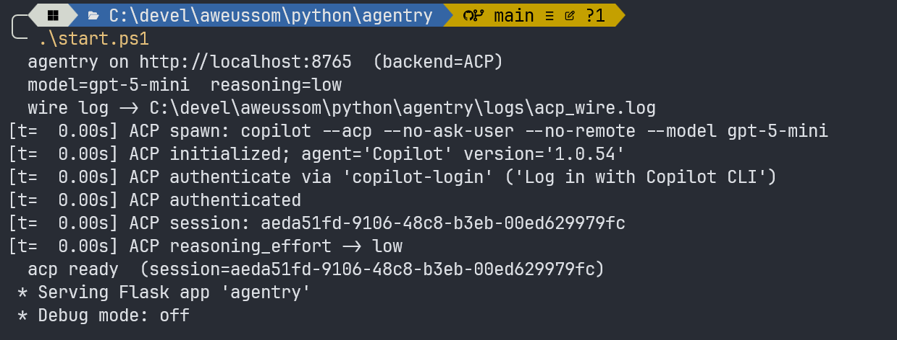
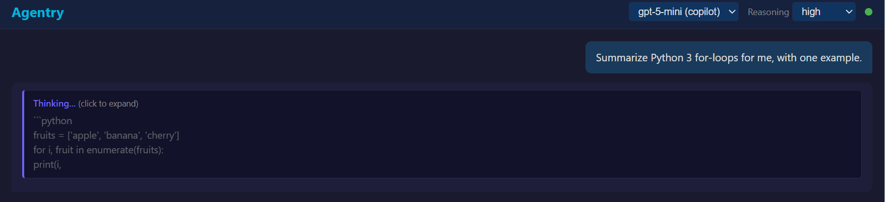

# Agentry

**Point your OpenAI SDK at the coding-agent subscription you already pay for.**
*The agent built to call tools becomes the tool.*

Agentry wraps a coding-agent CLI — GitHub Copilot, OpenAI Codex, or Claude Code —
and serves the model behind it as a plain OpenAI-compatible HTTP API on localhost.
Your scripts, apps, and pipelines talk to `gpt-5.6-luna` or `claude-sonnet` through the
subscription you're already logged into — no separate API bill, no `-p` spawn tax.

[](https://dev.to/tommy_leonhardsen_81d1f4e/i-built-an-openai-compatible-proxy-for-github-copilot-because-search-was-too-stupid-to-understand-31de)

If you'd rather read the unhinged origin story than boring sysadmin-grade
docs, the [dev.to version is here](https://dev.to/tommy_leonhardsen_81d1f4e/i-built-an-openai-compatible-proxy-for-github-copilot-because-search-was-too-stupid-to-understand-31de) —
it covers why this proxy exists in the first place (short answer:
Norwegian guitar tabs and questionable life choices). The rest of this
README is the boring documentation, which sysadmins know to love.

It holds one coding-agent CLI subprocess persistent across requests, drives it
over JSON-RPC 2.0 (stdio), and exposes the result as an OpenAI-compatible HTTP
API on localhost. Per-turn latency drops from ~8 s in `-p` mode to roughly the
model's own `api_ms` floor (~1.5 s for short replies with `gpt-5.6-luna` at
`low` reasoning effort).

A minimal chat **web UI** ships with the proxy. It is not the point of the
project — just a quick way to confirm the API works end-to-end. The launcher
prints a clickable URL (`http://localhost:8765` by default) on startup.


> **Intended use:** a personal, localhost-only adapter. Each backend stays
> authenticated through its own official client/interface and remains subject
> to that provider's terms — agentry adds no access path, credentials, or
> multi-user service on top. Don't expose it publicly.

Wraps three interchangeable backends, selected with `--backend`:

- **`copilot`** (default) — GitHub Copilot via the official
  [Copilot SDK](https://github.com/github/copilot-sdk). The cheapest tier —
  billed in Copilot AI credits per token; default `gpt-5.6-luna`
  (lightweight price band, $0.20/M input) at `low` reasoning.
- **`codex`** — OpenAI Codex (`codex app-server`). The paid-but-cheap tier
  (ChatGPT Go $8 / Plus $20); runs whatever model codex itself is configured
  for (see note under Configuration) at `low` effort. Metered in **Codex
  credits** since April 2026 (token-aligned, per-model: `gpt-5.6-luna` is
  25× cheaper per token than `gpt-5.6-sol`) against 5h/weekly windows —
  the 5h window is suspended for paid plans since July 2026.
- **`claude`** — Anthropic Claude Code (`claude -p`). The premium tier;
  default `claude-sonnet-4-6`.

The copilot and codex backends hold one persistent runtime process (copilot
through the SDK's managed server, codex over hand-rolled JSON-RPC 2.0 stdio),
so both get the no-spawn-cost win. claude-code has no such server mode, so the
`claude` backend is **cold-start** — one fresh `claude -p` per turn, ~2.5s
overhead (lean config), trading that for zero cross-turn context bleed. It's
built for long single-shot tasks (e.g. exam enrichment, 40–90s/turn) where the
startup is noise. See `archive/CLAUDE-PLAN.md`. Adding a backend is implementing
one `Backend` class in `backends.py`.

**Contents:**
[The idea](#the-idea-reverse-mcp) ·
[Status](#status) ·
[Quick start](#quick-start) ·
[Configuration](#configuration) ·
[Architecture](#architecture) ·
[Per-project instructions](#per-project-instructions) ·
[File map](#file-map) ·
[Known limits](#known-limits) ·
[Roadmap](#roadmap) ·
[Related work](#related-work)

## The idea: reverse MCP

The Model Context Protocol (MCP) standardizes one direction: how a model
*consumes* external capabilities. A host app embeds an LLM and connects to MCP
servers that expose tools and data — the arrow points `LLM ──▶ tools`.

Agentry points the arrow the other way. A coding-agent CLI is, by design, an
MCP *client*: it exists to call tools. Agentry wraps that agent and serves the
model as a plain HTTP endpoint, so ordinary software consumes the model instead:

```
MCP       LLM  ───▶  tools / data      (the model consumes capabilities)
agentry   code ───▶  LLM  (HTTP)       (your code consumes the model)
```

The agent built to call tools becomes the tool. And agentry *enforces* the flip
rather than just narrating it: every backend runs with its tool surface switched
off — the copilot session is created with an empty tool allowlist plus a deny-all
permission handler; codex and claude get every tool/permission/filesystem request
refused at the wire (JSON-RPC `-32601`). Stripped of its ability to consume
tools, the agent is left as a pure language service behind an OpenAI-shaped API.

A lens, not a protocol: agentry speaks the OpenAI chat API, not MCP, and does
not interoperate with MCP tooling. The point is the direction of the arrow —
turning a tool-using agent into a tool other programs use — not a shared wire
format.

## Status

In production — the author's primary enricher across adjacent projects
(`shiny-fiesta`, soon `geomap`). Three backends:
`copilot` (free), `codex` (paid-cheap), and `claude` (premium, cold-start) —
see `TODONT.md` for which other CLIs were considered and declined.
Auth uses your existing CLI logins via the local credential store.

ToS posture differs per backend. The `copilot` backend rides the official
[GitHub Copilot SDK](https://github.com/github/copilot-sdk) (GA) — embedding
Copilot programmatically is now a *supported* product surface, not a hack.
Agentry walks in through the front door, papers in order. Is "confiscate the
agent's tools and serve the bare model back out as an OpenAI endpoint" the
use case GitHub pictured when they published an SDK for embedding agents?
Almost certainly not. But that's the thing about front doors: once you're
invited in, nobody dictates what you cook. Sanctioned entrance, unexpected
choreography — such is the world. The `codex` and `claude` backends still
wrap interactive CLIs programmatically and sit in the usual gray ToS zone —
for those, use a non-critical account, don't expose externally, keep volume
modest.

## Quick start

Common prerequisites:

- Python 3.11+ (the `github-copilot-sdk` dependency requires it)
- For the `copilot` backend: a GitHub account logged in to Copilot on this
  machine (`copilot login` once, from any installed Copilot CLI). The SDK
  downloads and caches its own pinned CLI runtime on first start — a native
  binary, so Node.js is NOT required to run agentry — but reads the same
  `~/.copilot` credential store the login wrote.
- For the `codex` backend: OpenAI Codex CLI on PATH and logged in
  (`codex login`, ChatGPT account — no `OPENAI_API_KEY` needed).
- For the `claude` backend: Claude Code CLI on PATH and already logged in
  (its own OAuth/API key); `-p` runs headless and never prompts.

### Windows (PowerShell 7+)

The launcher must be run from the same logon session as your interactive
`copilot login` so the cred-store token is reachable to child processes.

```powershell
cd C:\devel\aweussom\python\agentry
.\start.ps1                                          # copilot, gpt-5.6-luna, reasoning=low
.\start.ps1 -Backend codex                           # codex, model from codex config, effort=low
.\start.ps1 -Backend claude                          # claude, claude-sonnet-4-6 (cold-start)
.\start.ps1 -Port 9000
```



### Linux / WSL2 Ubuntu

One-time login inside your Linux environment (in WSL2, inside WSL — not via
the Windows host; the npm CLI is only needed for this login step):

```bash
npm install -g @github/copilot
copilot login

cd ~/path/to/agentry
chmod +x start.sh                                    # first checkout only
./start.sh                                           # copilot, gpt-5.6-luna, reasoning=low
./start.sh --backend codex                           # codex, model from codex config, effort=low
./start.sh --backend claude                          # claude, claude-sonnet-4-6 (cold-start)
./start.sh --port 9000
```

Open `http://localhost:8765` (or the port you chose) and chat. From a WSL2
shell, the same URL works from a Windows browser thanks to automatic port
forwarding.

## Configuration

Launcher params:

- `-Port` — HTTP port (default `8765`).
- `-Backend` — `copilot` (default), `codex`, or `claude`.
- `-Model` — model override.
    - `copilot`: set as the SDK session's model. Default `gpt-5.6-luna`.
      Since June 2026 Copilot bills all models in **AI credits per token**
      (1 credit = $0.01), so the model choice sets your burn rate: the
      lightweight band (`gpt-5.6-luna` $0.20/M input / $1.20/M output) is
      ~10× cheaper than `gpt-5.6-terra` and ~25× cheaper than `gpt-5.6-sol`.
      The available set tracks Copilot's plans — check your plan's model
      picker rather than this README.
    - `codex`: passed on `turn/start`. No default — when unset, agentry
      omits the override and each thread runs on codex's own configured
      model (`~/.codex/config.toml`).

      > **Note:** codex persists the model you last selected in its
      > interactive TUI to that same config file. So without an explicit
      > `-Model`, switching models in the codex TUI **silently changes what
      > agentry uses** from its next thread on. This is deliberate — it
      > tracks OpenAI's model migrations (e.g. `gpt-5.4-mini` →
      > `gpt-5.6-luna`) without a code change — but if you need a stable
      > prod model, pin it with `-Model`. The startup log's
      > `codex thread: ... (default model=...)` line shows what each thread
      > actually resolved to.
    - `claude`: passed to `claude --model`. Default `claude-sonnet-4-6`.
- `-ReasoningEffort` — `none`/`minimal`/`low`/`medium`/`high`/`xhigh`/`max`.
  What actually applies is per model: the gpt-5.6 copilot models advertise
  `none`→`max` (models.list), codex takes `none`→`xhigh`, and a model that
  rejects a level keeps its previous one (logged as a WARN, not an error).
  On `copilot` it is a session parameter (live changes go through the SDK's
  model-switch call); on `codex` it is a `turn/start` param.
  **No-op on `claude`** — claude-code (`-p`) exposes no reasoning-effort knob.

### Per-request model and effort (OpenAI-style)

The launcher values are only *defaults*. Like a normal OpenAI endpoint,
`/v1/chat/completions` honors the request body per call:

- `"model"` — switches the backend (copilot: live `session.model/switchTo`
  with conversation history preserved; codex/claude: applies from the next
  turn/spawn). Ids are validated against the account's model list (copilot
  `models.list`, codex `model/list`); an unknown id returns an OpenAI-style
  `404 model_not_found` instead of silently running on a fallback. `/v1/models` returns the real
  model list (with an `active` flag and AI-credit `price_category`), and
  response `model` fields report what the runtime *actually* ran — a pin
  silently overridden by org policy shows up as the override, not the wish.
- `"reasoning_effort"` — same vocabulary as `-ReasoningEffort` above.

One caveat: model/effort are **session-scoped, not request-isolated**.
Concurrent clients that ask for different models take turns switching the
shared session (last write wins) — pin one model per agentry instance if you
need strict isolation.

The web UI exposes both: a model picker fed by `/v1/models` (labeled with
each model's price band) and the full reasoning-effort dropdown.

### Console

When idle, the launcher console pulses a `...*...*...*` heartbeat that rewrites
itself in place once a second (no scroll). While a `copilot` turn is in flight,
that same line becomes a **news ticker**: it scrolls the model's current output
line — the streamed reasoning summary while it thinks, then the response as it
writes — restarting whenever the model moves to a new line. Long high-effort
turns show visible work instead of a silent console. On the `codex` backend it also drops
a permanent quota line into scrollback when going idle and every ~10 min after —
e.g. `codex plus quota | weekly 99% left (resets 20 Aug 17:04)` (plus a
pay-as-you-go credits balance when the account has one) — and appends each
turn's exact token usage and rate-card cost estimate to its completion line:
`tokens in=12677 (cached 9984) out=6  ~0.019 credits (session ~0.019)`.
The quota figure is primed at startup (`account/rateLimits/read`) and kept
fresh by the rate-limit snapshots codex pushes per turn; token counts come
from `thread/tokenUsage/updated` — no extra API calls during normal use.
(Output redirected to a file suppresses the heartbeat; the permanent quota
lines still appear.)

#### copilot quota (AI credits)

Since June 2026 Copilot bills **AI credits per token** (1 credit = $0.01,
priced per model), and the `copilot` backend meters that live:

- every turn's completion logs its exact cost — `turn cost 0.011 credits
  (session total 1.455)` — from the SDK's per-turn `AssistantUsageData`
  events (`copilotUsage.totalNanoAiu`, 10⁹ nanoAIU = 1 credit);
- the periodic idle snapshot adds this machine's calendar-month total, read
  from the Copilot runtime's own ledger (`~/.copilot/session-store.db`,
  which agentry's SDK sessions update directly — no interactive copilot-cli
  needed): `session 1.46 AIC · machine 36 AIC this month`.

The **account-wide plan meter** (the `1,234/5,000`-style readout) counts every
device and surface and is not exposed by any public API, so the machine
figure is a floor, not the plan readout. (An earlier opt-in feature metered
the pre-June-2026 premium-request billing via a GitHub PAT; it was removed
because base models then read a permanent `0/N` and SSO accounts returned
HTTP 400/403 from user-level billing.) The startup ready-line prints the
authenticated login (`user=...`) so you can always see which account is
serving — and paying for — requests.

#### claude quota

The `claude` backend shows your real Claude Code OAuth usage (5-hour session %
and weekly %) when [`claude-code-quota`](https://github.com/aweussom/claude-code-quota)
is installed — it keeps `~/.claude/quota-data.json` fresh off claude's own
status-line ticks (no daemon). agentry reads that cache passively (no network,
no extra dependency), rendering e.g.:

```
claude quota | 5h 54% left (resets in 31m) | weekly 74% left (resets in 1d15h)
```

If the tool isn't installed, it falls back to the coarse `rate_limit_event`
claude streams each turn (status + reset window, no %), e.g.
`claude five_hour: allowed (resets 31 May 12:10)`.

## Architecture

`agentry.py` is the Flask layer (routes, OpenAI shape, session reuse).
`backends.py` holds a `Backend` ABC and the three implementations. The
copilot backend delegates transport to the official `github-copilot-sdk`
(which runs the Copilot CLI runtime in server mode and speaks JSON-RPC to
it); codex owns a persistent subprocess driven by a small hand-rolled
JSON-RPC 2.0 client; claude cold-starts one `claude -p` process per turn.
The Flask layer talks only to the `Backend` interface (`new_session` /
`prompt` / `cancel` / `update_reasoning_effort` / `is_alive` / `close`), so
swapping backends is a `--backend` flag.

The turn lifecycles map almost one-to-one:

| Concept | `copilot` (SDK) | `codex` (app-server) |
|---|---|---|
| Handshake | `CopilotClient.start()` | `initialize` |
| New session | `create_session()` | `thread/start` |
| User turn | `session.send()` | `turn/start` |
| Reasoning override | session param / `set_model()` | `effort` on `turn/start` |
| Streamed deltas | `AssistantMessageDelta` events | `item/agentMessage/delta` |
| Turn complete | `SessionIdle` event | `turn/completed` notification |
| Cancel | `session.abort()` | `turn/interrupt` (`threadId`+`turnId`) |

In both, the agent's tool surface is switched off to keep the proxy a pure
chat client (no agent capabilities — by design): the copilot session is
created with an empty tool allowlist (`available_tools=[]`) plus a deny-all
permission handler; codex gets tool/permission/filesystem requests refused
with JSON-RPC `-32601` and additionally runs each thread with
`approvalPolicy: never` + `sandbox: read-only`. This is where the reverse-MCP
inversion is enforced: the tool-consuming half is off, leaving only the
language model to be served.

Turn lifecycle is hardened against the ugly paths: a codex `turn/start` that
errors (bad model, dead thread) is surfaced to the client immediately instead
of stalling until the stream timeout; a turn abandoned by timeout is cancelled
server-side (`session.abort()` / `turn/interrupt`) so it stops burning quota;
and stray updates from an abandoned turn are dropped (copilot: the event
queue is turn-scoped; codex: updates tagged with a stale turn id are
filtered), so a zombie turn can never bleed text into the next request's
response.

OpenAI-compatible endpoints exposed:

- `GET /health` — readiness probe.
- `GET /v1/models` — single model entry reflecting current `-Model`.
- `POST /v1/chat/completions` — SSE streaming, standard OpenAI delta format.
- `POST /v1/cancel` — cancels the in-flight turn (copilot: `session.abort()`;
  codex: `turn/interrupt` with the active turn's id; claude: kills the
  `claude -p` process).

The web UI at `/` is a single-page chat copied and pared down from the
NoLlama project. Markdown rendering, code-block copy, image attach
(button / paste / drag-drop — sent as `image_url` data: URIs), and live
think-blocks: the server forwards copilot's streamed reasoning summaries as
`delta.reasoning_content` (the DeepSeek-popularized SSE extension; standard
OpenAI clients ignore it) and the UI folds them into a collapsible
"Thinking..." block above the answer. Codex reasoning
(`item/reasoning/textDelta`) is not forwarded yet.



**Artifacts**: fenced ` ```html `, ` ```svg `, and ` ```markdown ` blocks in
a reply get an "open ▸" button that renders them in a side panel — HTML/SVG
in a sandboxed iframe (scripts run, but no same-origin access to the chat
page), markdown through a small built-in document renderer (headers, lists,
tables, quotes, links, code). Esc closes the panel.
`.github/copilot-instructions.md` asks the model to precede renderable
documents with YAML frontmatter (`title: ...`); the UI consumes it — the
title labels the open button and the panel header instead of rendering as
text. Frontmatter is optional: untitled fences still get a plain open
button, and stray `---` blocks without a `title:` render as ordinary text.

## Per-project instructions

`.github/copilot-instructions.md` is loaded by Copilot for each session
it opens in this directory. It tells the agent: treat prompts as standalone
chat questions, do not read repo files, do not request tools, do not inject
system reminders or context hints, be terse. This overrides any global
custom-instructions file in `~/.copilot/` that would otherwise leak hints
(SQL tables, todo lists, etc.) into prompts.

## File map

| Path | Purpose |
|---|---|
| `agentry.py` | Flask server + OpenAI surface + backend selection |
| `backends.py` | `Backend` ABC + `CopilotSDKBackend` + `CodexAppServerBackend` + `ClaudeCodeBackend` |
| `logutil.py` | Shared timestamped logging + idle keepalive |
| `templates/index.html` | Web UI shell |
| `static/css/style.css` | Web UI styles |
| `static/js/app.js` | Web UI client logic |
| `.github/copilot-instructions.md` | Per-project chat-only instructions |
| `start.ps1` / `start.sh` | Launchers (create venv, run agentry) |
| `requirements.txt` | `flask` + `github-copilot-sdk` |
| `TODO.md` | Roadmap and known polish items |
| `TODONT.md` | Paths intentionally not taken, with reasons |
| `archive/CODEX-PLAN.md` | Codex backend design + validation record (archived) |
| `archive/CLAUDE-PLAN.md` | Claude Code backend design + startup-cost bench (archived) |
| `logs/` | Runtime traces (gitignored): `copilot_sdk.log`, `codex_wire.log`, `claude_wire.log` |

## Known limits

- **Tool requests are always denied.** If a prompt genuinely needs a tool
  (file read, shell command), the agent will either degrade gracefully or
  error out rather than working around it. By design.
- **Reasoning trace depends on backend.** Copilot's streamed reasoning
  summaries reach both the console ticker and the web UI's think-block
  (as `delta.reasoning_content` in the SSE stream). Codex also streams
  reasoning (`item/reasoning/textDelta`) but it is not forwarded yet;
  there you only get a typing indicator during server-side reasoning.
- **Auth is session-bound.** The Windows credential store entry that
  `copilot login` writes is reachable only to processes in the same
  interactive logon session. Running the launcher from a different shell
  or service account will fail to find the token.
- **Single user, single session.** Concurrent UI tabs share one backend
  session and serialize through one turn lock. Fine for personal use; not
  a multi-tenant design.
- **Codex carries a fixed ~24.8k-token core harness per turn.** codex
  app-server sends its agent system prompt + built-in tool schemas on every
  turn. It does not leak into responses, is not reducible by disabling
  plugins/MCP/skills (tested), and is cached server-side so it costs almost
  no latency. On a flat ChatGPT subscription it isn't separately billed.

## Roadmap

See `TODO.md` for active polish items and `TODONT.md` for paths
intentionally not taken. The backend layer is pluggable and ships three
backends (`copilot`, `codex`, `claude`). `claude-code` is `-p`-per-turn with
no persistent protocol — once deferred for that reason, but it landed as a
**cold-start** backend (2026-05-31): the ~2.5s spawn cost is noise against the
long enrichment turns it targets, and the per-turn isolation is a feature
(`archive/CLAUDE-PLAN.md`). The remaining candidates are declined, not
deferred: `qwen3-code` (Qwen sells a direct OpenAI-compatible API — nothing
subscription-locked to unlock) and `antigravity` (technically viable by
mid-2026, but the sponsored quota was cut to ~20 requests/day and Google has
suspended accounts for third-party subscription use — full reasoning in
`TODONT.md`). A new backend means implementing one `Backend` class, not a
refactor.

## Related work

[`ericc-ch/copilot-api`](https://github.com/ericc-ch/copilot-api) is the
best-known project exposing GitHub Copilot through an OpenAI-shaped API. It
reverse-engineers Copilot's internal HTTP endpoints directly (impersonating
an editor client) and is built as a general-purpose API gateway for any
client. It has been unmaintained since October 2025 — the community moved on
to the actively developed fork
[`caozhiyuan/copilot-api`](https://github.com/caozhiyuan/copilot-api), which
extends the same approach into a Copilot + Codex + third-party gateway.

The difference in integration surface turned out to be the difference that
matters:

- *copilot-api* and its forks speak Copilot's internal wire protocol.
  Broader scope and lower per-call overhead — but permanent exposure to
  upstream breakage. The original repo froze mid-chase, one
  "update vscode fallback ver" commit at a time; the forks inherit the
  treadmill.
- *Agentry* drives the official agent runtimes through their supported
  integration surfaces — the GitHub Copilot SDK and `codex app-server` — for
  one narrow use case: killing the per-call startup cost when a single
  developer uses these agents as an automation backend for their own
  scripts.

The multi-backend design also means agentry isn't tied to one vendor: the same
OpenAI-shaped endpoint fronts Copilot (free tier), Codex (cheap paid tier), or
Claude Code (premium), swapped with a flag. If you want a broad
Copilot-as-an-API gateway for many clients, the copilot-api family is wider in
scope — pick a maintained fork. If you want a thin local persistent wrapper
around the official agent surfaces with no reverse-engineering, that is
agentry.

## Acknowledgments

- [Agent Client Protocol](https://agentclientprotocol.com) by Zed Industries —
  the copilot backend's original transport, since replaced by the official
  Copilot SDK.
- Web UI based on the [NoLlama](https://github.com/aweussom/NoLlama)
  project (an OpenVINO-based LLM server for Intel NPU/GPU).
