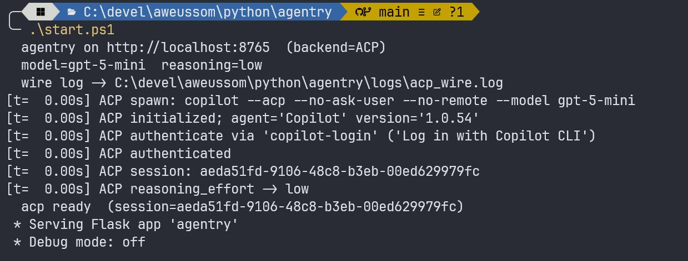

# Agentry

**Point your OpenAI SDK at the coding-agent subscription you already pay for.**
*The agent built to call tools becomes the tool.*

Agentry wraps a coding-agent CLI — GitHub Copilot, OpenAI Codex, or Claude
Code — holds it as one persistent process, and serves the model behind it as
an OpenAI-compatible HTTP API on localhost. Your scripts and pipelines talk to
`gpt-5.6-luna` or `claude-sonnet` through the subscription you're already
logged into: no separate API bill, no per-call spawn tax (~8 s in `-p` mode
drops to the model's own ~1.5 s floor).

[](https://dev.to/tommy_leonhardsen_81d1f4e/i-built-an-openai-compatible-proxy-for-github-copilot-because-search-was-too-stupid-to-understand-31de)

Prefer the unhinged origin story to sysadmin-grade docs? [The dev.to version
is here](https://dev.to/tommy_leonhardsen_81d1f4e/i-built-an-openai-compatible-proxy-for-github-copilot-because-search-was-too-stupid-to-understand-31de).

A minimal chat **web UI** ships with the proxy — markdown with code-copy,
image attach, live collapsible thinking blocks, a model picker fed by
`/v1/models`, and an artifact side panel that renders fenced `html`/`svg`/
`markdown` blocks. On the `codex` backend it also **generates and edits
images** through codex's built-in `gpt-image-2` tool, billed to the ChatGPT
plan rather than the API — inline in chat, and as OpenAI-shaped
`/v1/images/generations` and `/v1/images/edits` routes (see *API*). It is not the point of the project, just proof the API
works end-to-end. The launcher prints the URL (`http://localhost:8765`).


> **Intended use:** a personal, localhost-only adapter. Each backend stays
> authenticated through its own official client and remains subject to that
> provider's terms — agentry adds no access path, credentials, or multi-user
> service on top. The `copilot` backend rides the official Copilot SDK, a
> supported product surface; `codex` and `claude` wrap interactive CLIs
> programmatically and sit in the usual gray ToS zone — use a non-critical
> account there, keep volume modest, and never expose the port publicly.

## The idea: reverse MCP

MCP standardizes one direction: how a model *consumes* tools
(`LLM ──▶ tools`). Agentry points the arrow the other way. A coding-agent CLI
is an MCP *client* — it exists to call tools. Agentry confiscates them and
serves the bare model back out, so ordinary software consumes the model
instead (`code ──▶ LLM`).

The flip is enforced, not narrated: every backend runs with its tool surface
switched off. The copilot session is created with an empty tool allowlist and
a deny-all permission handler; codex and claude get every tool, permission,
and filesystem request refused at the wire (JSON-RPC `-32601`), and codex
threads additionally run `approvalPolicy: never` + `sandbox: read-only`.
Stripped of its ability to consume tools, the agent is left as a pure
language service behind an OpenAI-shaped API.

## Backends

Selected with `--backend`. Adding one means implementing a single `Backend`
class in `backends.py`.

| Backend | Wraps | Cost tier | Defaults |
|---|---|---|---|
| `copilot` (default) | the official [Copilot SDK](https://github.com/github/copilot-sdk) | Copilot AI credits per token (1 credit = $0.01); `gpt-5.6-luna` is the cheap band ($0.20/M in), ~10× under `terra`, ~25× under `sol` | `gpt-5.6-luna` @ `low` |
| `codex` | `codex app-server` (persistent JSON-RPC stdio) | ChatGPT Go $8 / Plus $20; Codex credits per token, `luna` 25× cheaper than `sol` | codex's own configured model @ `low` |
| `claude` | `claude -p`, one fresh process per turn | Claude subscription (premium) | `claude-sonnet-4-6` |

`copilot` and `codex` hold one persistent runtime process, so turns cost only
model latency. Claude Code has no server mode, making `claude` a
**cold-start** backend (~2.5 s spawn per turn) — built for long single-shot
tasks (40–90 s enrichment turns) where the spawn is noise and per-turn
isolation is a feature.

## Quick start

Prerequisites: Python 3.11+ plus the CLI login for the backend you use:

- `copilot` — `copilot login` once from any installed Copilot CLI. The SDK
  downloads its own pinned native runtime (Node.js not needed to *run*
  agentry) and reads the same `~/.copilot` credential store.
- `codex` — Codex CLI on PATH, `codex login` (ChatGPT account, no API key).
- `claude` — Claude Code CLI on PATH and logged in; `-p` never prompts.

**Windows (PowerShell 7+)** — run from the same logon session as your
interactive `copilot login`, or the credential-store token is unreachable:

```powershell
.\start.ps1                          # copilot, gpt-5.6-luna, effort=low
.\start.ps1 -Backend codex           # model from codex config
.\start.ps1 -Backend claude
.\start.ps1 -Port 9000
```

**Linux / WSL2** — log in inside your Linux environment (in WSL2: inside WSL,
not via the Windows host; npm is only needed for this login step):

```bash
npm install -g @github/copilot && copilot login     # one-time
./start.sh                           # flags: --backend codex|claude, --port 9000
```

Open `http://localhost:8765` and chat. From WSL2 the same URL works in a
Windows browser via automatic port forwarding.



## Configuration

Launcher params (`start.ps1 -Flag` / `start.sh --flag`):

- **Port** — HTTP port, default `8765`.
- **Backend** — `copilot` (default), `codex`, or `claude`.
- **Model** — override the default.
  - `copilot`: set as the SDK session's model, validated against your plan's
    `models.list`. The available set tracks Copilot's plans — check your
    model picker, not this README.
  - `codex`: sent per `turn/start`. When unset, each thread runs whatever
    `~/.codex/config.toml` says — and the codex TUI *writes your last picked
    model there*, so agentry silently follows TUI switches unless you pin
    `-Model`. Deliberate (it tracks OpenAI's model migrations for free), but
    pin for prod. The startup log's `codex thread: ... (default model=...)`
    line shows what each thread resolved to.
  - `claude`: passed to `claude --model`.
  - A pinned model is validated at startup against the backend's model list
    (copilot `models.list`, codex `model/list`); an unknown id exits with
    code 2 and prints what *is* available, instead of coming up "ready" and
    failing every turn. Codex's ids are OpenAI's (`gpt-5.6-sol` /
    `-terra` / `-luna`, `gpt-5.5` as of 2026-09) — there is no Claude on
    codex.
- **ReasoningEffort** —
  `none`/`minimal`/`low`/`medium`/`high`/`xhigh`/`max`/`ultra`. What applies
  is per model: copilot's gpt-5.6 models advertise `none`→`max`, codex takes
  `none`→`ultra` (`ultra` is codex-only: "maximum reasoning with automatic
  task delegation"); a model that rejects a level keeps its previous one
  (WARN, not an error). **No-op on `claude`** — `-p` exposes no effort knob.

### Per-request model and effort

Launcher values are only defaults. Like a normal OpenAI endpoint, model and
effort are **request fields, not server state** — each turn runs on exactly
what its request asked for, applied atomically with the turn:

- `"model"` — copilot: the live session is switched under the turn lock
  (conversation history preserved); codex: a `turn/start` param; claude: the
  spawn's `--model`. Ids are validated against the account's model list;
  unknown ids return an OpenAI-style `404 model_not_found` instead of
  silently running a fallback. Requests that omit `model` run the launcher
  default (or the backend's own default when unpinned) — selection is never
  sticky.
- `"reasoning_effort"` — same vocabulary as `-ReasoningEffort`, same
  per-turn semantics.

Concurrent clients can safely request different models: turns serialize
through one lock and each runs its own selection. On copilot they still
share one *conversation* (single session), so history is common even though
the model per turn is not. `/health` and the `active` flag in `/v1/models`
report the model a selection-less request runs on, verified against the
runtime where possible — a pin silently overridden by org policy shows up
there as the override, not the wish.

## Console & quota

Idle, the console pulses an in-place heartbeat; during a turn it becomes a
news ticker scrolling the model's current reasoning/output line. Each backend
also meters spend live:

- **copilot** — per-turn AI-credit cost from the SDK's usage events
  (`turn cost 0.011 credits (session total 1.455)`), plus this machine's
  calendar-month total read from the Copilot runtime's own ledger
  (`~/.copilot/session-store.db`). The account-wide plan meter counts every
  device and isn't in any public API, so the machine figure is a floor. The
  ready-line prints which login (`user=...`) is paying.
- **codex** — a quota line at idle and every ~10 min
  (`codex plus quota | weekly 99% left (resets 20 Aug 17:04)`), plus each
  turn's exact tokens and rate-card cost estimate
  (`tokens in=12677 (cached 9984) out=6  ~0.019 credits`). Primed at startup
  and kept fresh by codex's own push notifications — no extra API calls.
- **claude** — real 5-hour/weekly OAuth usage when
  [`claude-code-quota`](https://github.com/aweussom/claude-code-quota) is
  installed (agentry reads its cache passively); otherwise the coarse
  `rate_limit_event` claude streams per turn (status + reset, no %).

## API

- `GET /health` — readiness probe.
- `GET /v1/models` — the account's real model list (copilot `models.list`,
  codex `model/list`) with an `active` flag and credit `price_category`;
  single synthetic entry when the backend can't enumerate.
- `POST /v1/chat/completions` — SSE streaming in standard OpenAI delta
  format; images ride as `image_url` data: URIs; copilot's streamed reasoning
  summaries are forwarded as `delta.reasoning_content` (the
  DeepSeek-popularized extension; standard clients ignore it). Images the
  backend *generates* (codex, see below) arrive as `delta.images` /
  `message.images` — OpenRouter's convention, a list of `image_url` data:
  URIs — never inline in `content`, so a client parsing JSON out of the
  reply is unaffected.
- `POST /v1/images/generations` — OpenAI Images API shape over codex's
  built-in image tool: `{"prompt": ...}` → `{"data": [{"b64_json",
  "revised_prompt", "size"}]}`. One image per call. `size` is honored as an
  **aspect ratio**, not a pixel count: codex pins `gpt-image-2` at
  `size=auto`, which reads the prompt, so agentry turns `1536x1024`,
  `1024x1536`, `1024x1024` or any `WxH` into explicit orientation wording,
  and the output lands at that ratio inside a fixed ~1.57-megapixel budget
  (1536×1024, 1024×1536, 1254², 1672×941 for 16:9). Each `data[]` entry
  carries the PNG's real `size`; resize downstream if you need exact
  pixels. `quality` is accepted and ignored (hardcoded `auto`). Other
  backends answer 501.
- `POST /v1/images/edits` — the same, anchored on reference images: OpenAI's
  multipart form (`image` / `image[]` file parts + `prompt`), or JSON with
  `image` as a data: URI (or a list of up to 5). The references ride the
  codex turn as attached images and its tool edits against them. Without
  `size`, the output takes the reference's proportions but the *prompt*
  decides orientation (a downstream 16:9 reference came back 941×1672 for
  "a standing figure filling the frame"); pass `size` to pin it. `mask` is
  rejected (400):
  codex's tool takes whole-image references only. Both Images routes run
  each call on a throwaway codex thread, so a batch of edits never
  accumulates old references in one context and never disturbs the chat
  session; they still serialize with chat turns through the one turn lock.
- `POST /v1/cancel` — cancels the in-flight turn (copilot `session.abort()`,
  codex `turn/interrupt`, claude kills the process).

### Image generation (codex)

codex-cli ≥ 0.149 ships image generation as a stable, on-by-default
built-in tool, and it works over `app-server` under agentry's locked-down
thread (no approvals, read-only sandbox, empty cwd — probed on 0.154.0,
`_bench/codex_imagegen_probe.py`). agentry's chat-only developer
instructions carve it out as the one permitted tool, *only when the user
explicitly asks for an image*, so enrichment prompts stay image-free. Ask
for a picture in the web UI and it renders under the reply; ~15–20 s per
image with a short prompt, ~45 s with a long prompt plus a 0.7 MB reference
(downstream measurement), calls serialize through the one turn lock, so a
batch of 30 is ~20 min of wall clock. ~0.7–1.4 MB PNG; a copy is also left in
`~/.codex/generated_images/<thread>/` by codex itself.

Cost is the point: the image bills against the **ChatGPT-plan window**
(three probe images moved a Plus 5-hour window by at most one integer
percentage point in total), not against API pricing, where the same
image on `gpt-image-*` is ~1 US cent. OpenAI's own guidance is that
image turns consume included usage "3–5× faster" than text turns — that is
a server-side weighting, not extra tokens: an image turn reports ~10
output tokens, so agentry's per-turn credits estimate understates it.
For batch generation OpenAI points at `OPENAI_API_KEY` billing instead.

## Architecture

`agentry.py` is the Flask layer (routes, OpenAI shape, session reuse);
`backends.py` holds the `Backend` ABC and the three implementations. Flask
talks only to the interface (`new_session` / `prompt` / `cancel` /
`is_alive` / `close`), so swapping backends is a flag; per-request model and
effort ride as `prompt()` arguments, applied inside each backend's turn lock.

The turn lifecycle is hardened against the ugly paths: a codex `turn/start`
error (bad model, dead thread) surfaces to the client immediately instead of
stalling to the stream timeout; a turn abandoned by timeout is cancelled
server-side so it stops burning quota; and stray updates from an abandoned
turn are filtered by turn id, so a zombie turn can never bleed text into the
next request's response.

`.github/copilot-instructions.md` pins per-session behavior for the copilot
backend (treat prompts as standalone chat, no repo reads, no tool requests,
be terse), overriding any global `~/.copilot/` instructions that would leak
context hints into prompts.

## File map

| Path | Purpose |
|---|---|
| `agentry.py` | Flask server + OpenAI surface + backend selection |
| `backends.py` | `Backend` ABC + copilot / codex / claude implementations |
| `logutil.py` | Timestamped logging + idle heartbeat/ticker |
| `templates/`, `static/` | Web UI |
| `.github/copilot-instructions.md` | Per-project chat-only instructions |
| `start.ps1` / `start.sh` | Launchers (create venv, run agentry) |
| `TODO.md` / `TODONT.md` | Roadmap / paths intentionally not taken |
| `archive/` | Backend design + validation records |
| `logs/` | Runtime wire traces (gitignored) |

## Known limits

- **Tool requests are always denied** — by design, with one carve-out:
  codex's built-in image generation, and only when a message explicitly
  asks for an image (see *Image generation*). Everything else — shell,
  file reads, MCP — is refused, so a prompt that genuinely needs a tool
  degrades or errors rather than working around it.
- **Reasoning trace depends on backend.** Copilot's and codex's streamed
  summaries reach the console ticker and the web UI think-block; claude
  forwards none.
- **Auth is inherited, not configured.** There is no token setting: agentry
  uses whatever login the backend CLI already has for the user running it
  (`copilot login`, `codex login`, Claude Code's own login). Start it from
  that user's own shell. Running it as a Windows service or under another
  account will not find the Copilot credential, which lives in the
  per-logon credential store.
- **Single user, single session.** Concurrent clients share one backend
  session and serialize through one turn lock — personal use, not
  multi-tenant.
- **Codex carries a fixed ~24.8k-token harness per turn** (its agent system
  prompt + tool schemas). Not reducible, cached server-side, not separately
  billed on a flat subscription. Beyond cost, that prefix is agent
  scaffolding the model reads before your prompt, so it can colour
  responses. Copilot is not free of this either, just ~5x lighter: the
  runtime's ledger shows a 22-byte prompt billed at ~5.3k input tokens on
  `gpt-5.6-luna` (~2.9k on `gpt-5-mini` in July), and about 900 of those
  are agentry's own `.github/copilot-instructions.md`, which is the one
  lever we do hold — it asks for terse, chat-only replies.

## Related work

The same itch — "I already pay for this agent, let my own code call the
model" — has been scratched once per vendor, many times over. Ordered by
maintenance activity as of 2026-09-11 (most recently pushed first); stars
are from the same day and will drift.

| Project | Wraps | How | Status 2026-09-11 |
|---|---|---|---|
| [`caozhiyuan/copilot-api`](https://github.com/caozhiyuan/copilot-api) | Copilot, codex, third-party APIs | reverse-engineered HTTP; Chat Completions + Responses + Anthropic Messages; Electron desktop app | very active — releases several times a week; ~1k★ |
| [`icebear0828/codex-proxy`](https://github.com/icebear0828/codex-proxy) | codex | ChatGPT backend API with the OAuth token; OpenAI/Anthropic/Gemini protocols; non-commercial license | very active; ~1.7k★ |
| [`messense/copilot-api-proxy`](https://github.com/messense/copilot-api-proxy) | Copilot | Rust reverse proxy, OpenAI + Anthropic endpoints | active; small |
| [`hotchpotch/openai-api-server-via-codex`](https://github.com/hotchpotch/openai-api-server-via-codex) | codex | Go server on the codex login token; PyPI/binaries | active; ~50★ |
| [`wende/claude-max-api-proxy`](https://github.com/wende/claude-max-api-proxy) | Claude Code | spawns `claude -p` per request (same cold-start trade as agentry's `claude` backend); OpenClaw integration | active; ~130★ |
| [`theblixguy/copilot-sdk-proxy`](https://github.com/theblixguy/copilot-sdk-proxy) | Copilot | the **official Copilot SDK** (TypeScript); Chat Completions + Anthropic + Responses; npm; the core of [`xcode-copilot-server`](https://github.com/theblixguy/xcode-copilot-server) | dependabot-only since 2026-07; ~10★ |
| [`rezrov/copilot-proxy`](https://github.com/rezrov/copilot-proxy) | Copilot | the official Copilot SDK (Node); client-owned tool loop; proposed in [copilot-sdk discussion #218](https://github.com/github/copilot-sdk/discussions/218), unanswered by GitHub staff | quiet since 2026-07; ~10★ |
| [`vkop007/codex-app-proxy`](https://github.com/vkop007/codex-app-proxy) | codex | persistent `codex app-server` — the same surface agentry's `codex` backend uses | abandoned 2026-02 |
| [`anshulpatel25/copilot-sdk-gateway`](https://github.com/anshulpatel25/copilot-sdk-gateway) | Copilot | Python Copilot SDK, one client per request | archived 2026-05 (author cites the move to usage-based billing) |
| [`ericc-ch/copilot-api`](https://github.com/ericc-ch/copilot-api) | Copilot | reverse-engineered HTTP; the original | dormant since 2025-11, 130+ open issues; ~4k★ — use the caozhiyuan fork |

Where agentry sits: every project above wraps **one** vendor; agentry puts
Copilot, codex and Claude Code behind the same endpoint, and drives each
through its supported surface (Copilot SDK, `codex app-server`, `claude -p`)
rather than reverse-engineered HTTP. It is also the only one that
**strips the tools** — the others expose tool execution as a feature, agentry
serves the bare model (see *reverse MCP* above) — and the only one with a
live credit/quota line in the console, which matters once a batch can drain
a month's allowance overnight. Want a broad multi-client gateway with a GUI?
Pick caozhiyuan or icebear0828. Want a thin local wrapper over the official
surfaces, with backend choice per launch? That's agentry.

## Acknowledgments

- [Agent Client Protocol](https://agentclientprotocol.com) by Zed Industries —
  the copilot backend's original transport, since replaced by the Copilot SDK.
- Web UI based on [NoLlama](https://github.com/aweussom/NoLlama) (an
  OpenVINO-based LLM server for Intel NPU/GPU).
